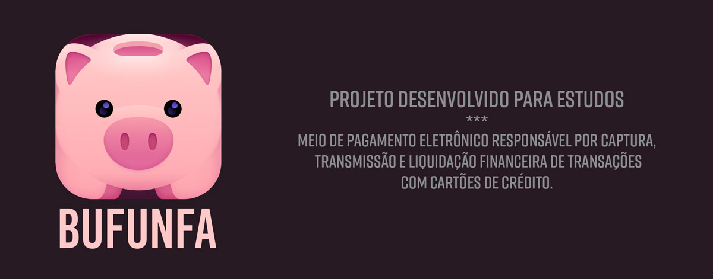
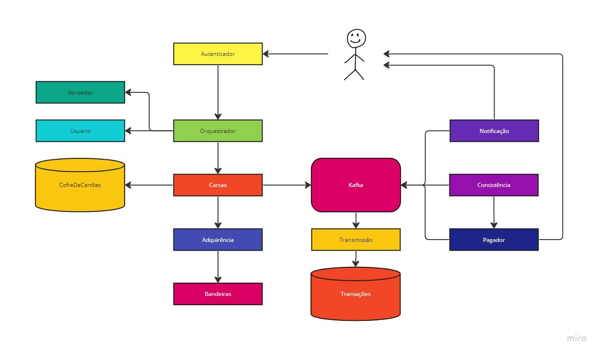

# Bufunfa

### Descrição:

App de pagamentos - Projeto em desenvolvimento para aplicação de tecnologias e conceitos em estudo. 

A princípio o app receberá pagamentos apenas de cartão de crédito e será evoluído com o tempo para outros meios, além de evoluir no que diz respeito a arquitetura e tratamentos.

### Arquitetura inicial:

[Projeto no Miro](https://miro.com/app/board/uXjVMeeQCi0=/?share_link_id=699541679461)

### Tecnologia / Características:

- Arquitetura de Microsserviços
- API REST
- Kotlin (Java 11)
- Spring Framework
- Programação reativa (Webflux)
- Kafka
- Redis
- Docker
- MySQL

